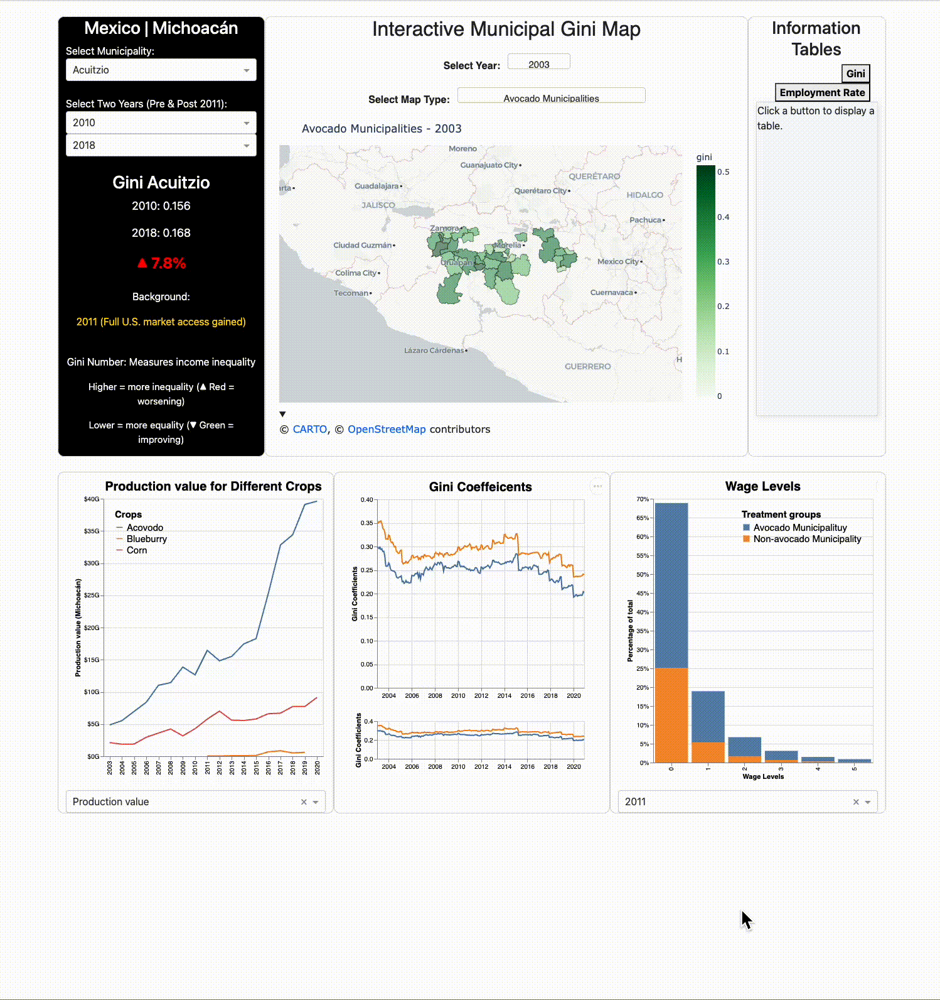

# Green Gold, Unequal Gains Dashboard 🥑

Please see our deployed [Green Gold dashboard](https://greengolddashboard.onrender.com/), supported by [Render](https://render.com/).

- [Green Gold, Unequal Gains Dashboard 🥑](#green-gold-unequal-gains-dashboard-)
  - [Introduction](#introduction)
  - [Dashboard Structure](#dashboard-structure)
  - [Demonstration](#demonstration)
  - [Sketch](#sketch)
  - [Contributors 😎](#contributors-)

## Introduction
The dashboard provides an in-depth analysis of the relationship between agricultural expansion—particularly the avocado 🥑 (`green gold`) boom—and wage inequality in Michoacán, Mexico, from 2003 to 2020. Using a map visualization of the Gini Coefficient, it highlights how economic disparities have evolved across different locations over time. A key focus is the impact of 2011, when Mexico gained full access to the U.S. avocado market, leading to rapid industry growth. The dashboard allows users to explore inequality trends before and after this turning point, offering insights into the broader economic effects of agricultural exports.

## Dashboard Structure
The dashboard is structured into multiple interactive sections to enhance user experience and data interpretation:

- 🗺️ Map (Main Panel): Displays spatial differences in wage inequality over the years, allowing users to compare Gini Coefficient variations across municipalities.
- 🎯 Top-Left Panel: Highlights key statistical findings related to agricultural production, wage inequality, and market trends.
- 📉 Right-Side Panel: Presents a detailed table containing municipality-level data, including production output, employment, and inequality metrics.
- 📈 Bottom Panel: Features trendlines for corn and blueberry production over the years, offering comparisons between different crops. Additionally, it includes a comparative trendline illustrating the Gini Coefficient for avocado-growing versus non-avocado-growing municipalities.

This comprehensive dashboard enables users to analyze how avocado production has influenced economic inequality, compare different agricultural industries, and gain deeper insights into the socioeconomic changes in Michoacán over nearly two decades.

## Demonstration

## Sketch
Please see our initial dashboard [sketch](./data/media/sketch.png)

## Contributors 😎
<!-- readme: contributors -start -->
<table>
	<tbody>
		<tr>
            <td align="center">
                <a href="https://github.com/TenTen-Teng">
                    
                     
                    <b>TenTen-Teng</b>
                </a>
            </td>
            <td align="center">
                <a href="https://github.com/SkylarShao97">
                    
                     
                    <b>Skylar Shao</b>
                </a>
            </td>
            <td align="center">
                <a href="https://github.com/VidalTinoco">
                    
                     
                    <b>Vidal Tinoco</b>
                </a>
            </td>
		</tr>
	<tbody>
</table>
<!-- readme: contributors -end -->

